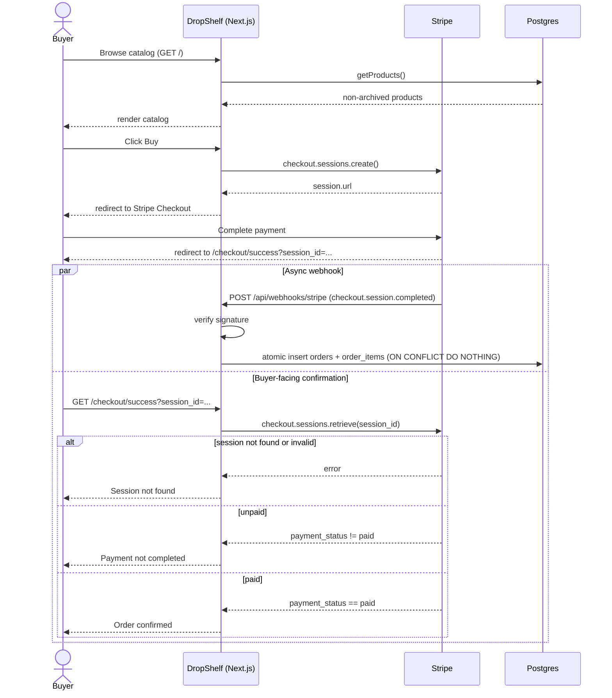
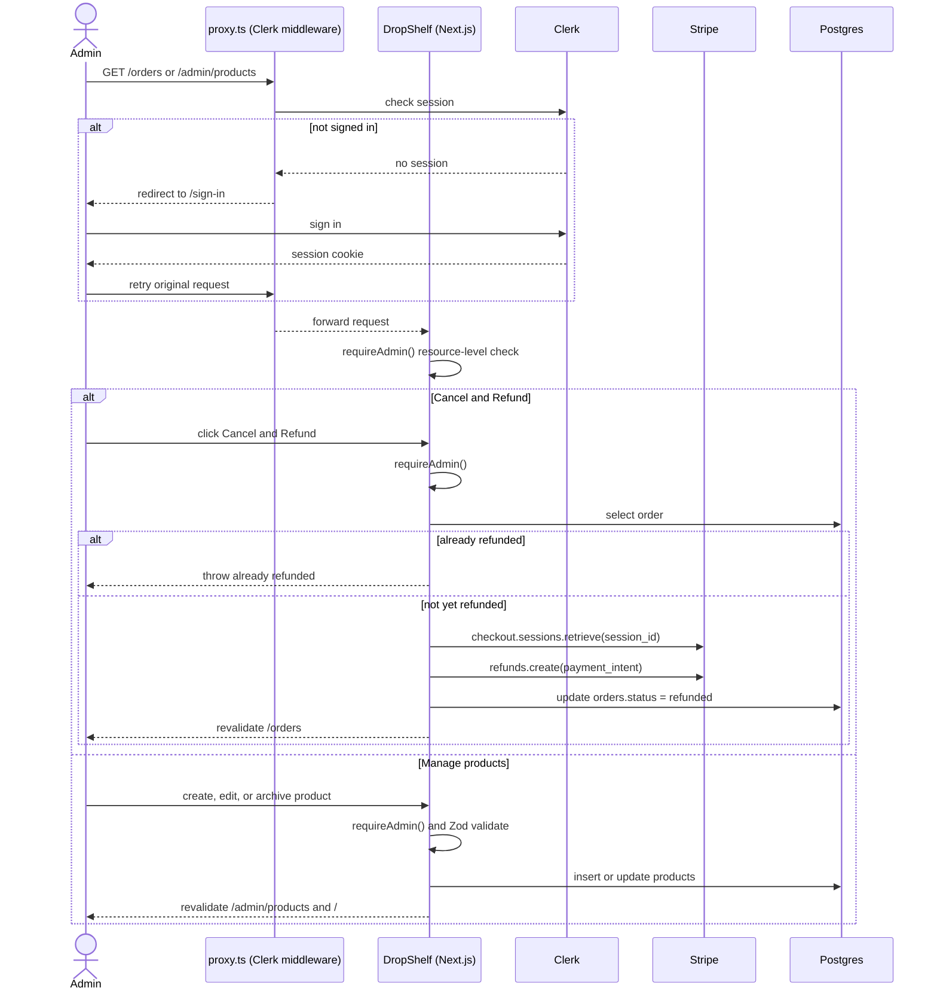
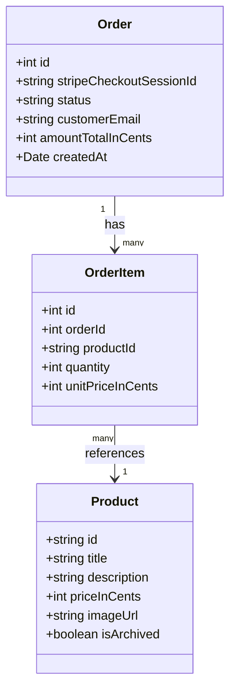

# DropShelf — UML Diagrams

For the Sprint 4 Engineering Demonstration: two UML sequence diagrams
covering the buyer and admin user actions, and a UML class diagram for the
underlying data model. GitHub and most Markdown viewers render Mermaid
blocks directly.

## Buyer flow (public, no sign-in)

Covers browsing, checkout, and the two independent paths that follow a
Stripe payment: the async webhook that persists the order, and the buyer's
own redirect back to a confirmation page that re-verifies against Stripe
rather than trusting the redirect.

## Admin flow (Clerk-gated: `/orders`, `/admin/*`)

Covers the Sprint 4 additions: signing in, cancelling an order for a Stripe
refund, and managing the product catalog. Every branch that mutates data
calls `requireAdmin()` itself, independent of the proxy-level redirect.

## Data model

`Order` has many `OrderItem`s; each `OrderItem` references exactly one
`Product`. Archiving a product only sets `isArchived` — the row is never
deleted, so `OrderItem.productId` always resolves and past orders keep
showing the correct product title.

## Notes for the demo

- **Two independent auth layers, on purpose.** `proxy.ts` (Clerk middleware)
  is the first, "optimistic" gate — it redirects a signed-out visitor before
  the page even renders. Every Server Action (`createProduct`,
  `updateProduct`, `archiveProduct`, `cancelOrder`) *also* calls
  `requireAdmin()` itself, because Server Actions are reachable independently
  of whether their page rendered. If asked "why check twice," this is the
  answer.
- **The webhook path is deliberately decoupled from the buyer's browser.**
  `/checkout/success` re-verifies directly against Stripe rather than reading
  the database, because the webhook write is async and might not have landed
  yet when the buyer's browser redirects back.
- **Archiving is soft delete, not row deletion** — see the data model above:
  the foreign key from `OrderItem` to `Product` is why a hard delete would
  either fail or corrupt historical order display.
- **Refunding is a status transition, not a general edit.** `cancelOrder`
  guards against double-refunding (checked before any Stripe call), so
  clicking Cancel & Refund twice on the same order can't charge Stripe twice.
